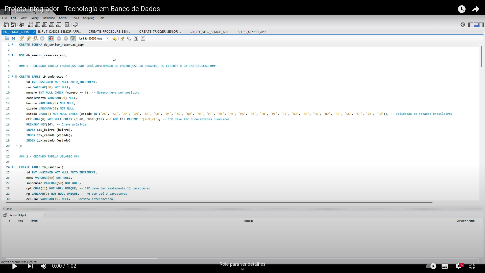

# Projeto Integrador - Implantação de Banco de Dados - Parte II

## Alunos:
- Aline Freire Anholete Morais
- Ana Luisa Andrade Vasconcelos
- Arcanjo Ricardo Souza da Silva
- Edna Miranda Santana
- Gabriela Carvalho Semensato
- Rafaela Bertuol

# Sênior Booking - Aplicativo de Agendamento e Monitoramento para Idosos

## Descrição do Projeto:
O Sênior Booking é uma plataforma digital projetada para o agendamento e monitoramento de atividades em creches especializadas para idosos. Este projeto foi desenvolvido com o objetivo de facilitar a gestão de cuidados e promover a autonomia dos usuários e das instituições. O projeto completo pode ser lido [NESTE LINK](https://drive.google.com/file/d/1pjYfpxScgnc2CeG29uFMzmQ4Bt-yg9WP/view?usp=sharing).

### Funcionalidades:
- **Agendamento Online**: Permite agendar atividades e consultas diretamente pelo aplicativo.
- **Monitoramento de Informações**: Inclui dados sobre medicamentos, alergias e capacidade funcional (usando a Escala de Katz).
- **Gestão Financeira**: Integrações com plataformas como PagSeguro para gerenciar pagamentos e notas fiscais.

## Estrutura do Banco de Dados:
- **Modelo Conceitual**: Identificação de entidades como Cliente, Atividade, Medicamento e Alergia.
- **Modelo Lógico**: Definição das tabelas e relacionamentos normalizados.
- **Modelo Físico**: Implementação com scripts SQL, incluindo procedures, triggers e views.

Toda a estrutura de modelos pode ser verificada [NESTE LINK](https://drive.google.com/file/d/1Obf1CjTkpdDdtcXPHUSFC7gpiuGgeNeR/view?usp=sharing).

## Metodologia:
Foi utilizada uma abordagem iterativa, passando pelas etapas de análise de requisitos, design, implementação, testes e feedback contínuo. O foco principal foi a eficiência e a usabilidade do sistema.

## Tecnologias Utilizadas:
1. **Docker** - Para criar um contêiner MySQL.
2. **MySQL Server** - O servidor de banco de dados.
3. **MySQL Workbench** - Para gerenciar e executar scripts SQL.
4. **Visual Studio Code (opcional)** - Para edição e organização de scripts SQL.

## Scripts DML e DDL:
- Os Scripts estão disponíveis nesse repositório do Github, já commitados.

## **Passo a Passo**

### 1. **Instalação das Ferramentas**

#### Docker
1. Faça o download e instale o [Docker Desktop](https://www.docker.com/products/docker-desktop).
2. Após a instalação, verifique se o Docker está funcionando com o comando:
   ```bash
   docker --version
   ```

#### MySQL (via Docker)
1. Crie um contêiner MySQL:

    ```bash
    docker run --name mysql_senior_app -e MYSQL_ROOT_PASSWORD=senha_root -p 3306:3306 -d mysql:8.0
    ```


2. Verifique se o contêiner está em execução:

    ```bash
    docker ps
    ```

#### MySQL Workbench
1. Baixe e instale o MySQL Workbench.
2. Configure uma conexão com o banco de dados MySQL:

    - Host: localhost

    - Porta: 3306

    - Usuário: root

    - Senha: senha_root


#### Visual Studio Code (opcional)
1. Faça o download e instale o Visual Studio Code.

2. Instale a extensão SQL Tools para facilitar a edição dos scripts.

### 2. **Configuração do Banco de Dados**
#### Executar os Scripts SQL
1. Abra o MySQL Workbench e conecte-se ao banco MySQL.

2. Execute os arquivos na ordem:

    - BD_SENIOR_APP.sql: Criação do esquema e tabelas.

    - INPUT_DADOS_SENIOR_APP.sql: Inserção de dados de exemplo.

    - CREATE_VIEW_SENIOR_APP.sql: Criação de views.

#### Criar Triggers e Procedures
- No mesmo ambiente do MySQL Workbench, execute os scripts de triggers e procedures conforme necessário (veja os exemplos incluídos na pasta).

### 3. **Estrutura do Projeto**

```bash
├── BD_SENIOR_APP.sql              # Script para criação das tabelas e esquema
├── INPUT_DADOS_SENIOR_APP.sql     # Dados de exemplo para o banco
├── CREATE_VIEW_SENIOR_APP.sql     # Criação de views do projeto
└── README.md                      # Documentação do projeto
```

### 4. **Testando a Implementação**
1. Conecte-se ao banco no MySQL Workbench.
2. Teste as queries com os dados de exemplo inseridos.
3. Verifique as views e os resultados de triggers/procedures.

- Abaixo está um vídeo demonstrando que todos os script apresentados nesse diretorio estão sendo testados e a saída foi OK em todos eles.

[](https://www.youtube.com/watch?v=vW4sEiFMvUQ "Assistir no Youtube")

### 5. **Contribuições**
Fique à vontade para abrir issues ou enviar pull requests para melhorias.